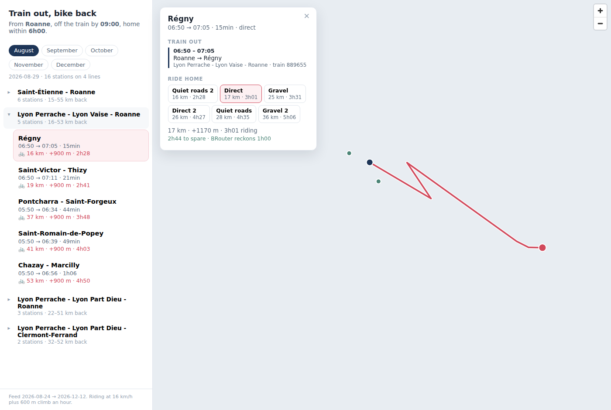

# vojeto

Take the train out in the morning, ride the bike home.

Given a home station, this works out every station you can reach by TER in time
to be off the train by a set hour, for one sample date per month the SNCF feed
covers, plans several cycling routes back from each, and keeps the ones whose
**train out plus ride home fits the time you actually have**. The result is a
static site: pick a month, open a line, click a station to compare ways home.



<sub>Captured without network access to the tile host, so the map falls back to a
plain background — with tiles you get a normal map underneath.</sub>

## Quick start

```sh
npm install
npm run ingest      # download the SNCF feed and check it against your config
npm run plan        # build public/data/plan.json
npm run dev         # http://localhost:5173
```

`npm run plan` writes into `public/`, which `npm run dev` serves live. A built
site only picks it up when it is rebuilt, so `npm run preview` rebuilds first.
The footer shows when the plan you are looking at was generated: if that is
older than your last run, you are looking at a stale page.

`ingest` is worth running on its own the first time: it prints which services the
filter kept, which station your home resolved to, where the ride home ends, and
which dates it will plan for. `plan` then does the real work — one BRouter
request per station per variant, throttled to one a second and cached on disk,
so the first run takes a few minutes and later ones are quick.

## Configuration

Everything personal lives in [`config/home.json`](config/home.json).

### Where you start and where you finish

```json
"home": {
  "station": { "query": "Roanne", "stopId": null },
  "rideTo": "46°02'03.80\"N 4°04'45.63\"E"
}
```

`station` is where you catch the train; `rideTo` is where the ride home ends,
which is usually your door rather than the station. `rideTo` takes decimal
degrees (`46.034389, 4.079342`) or DMS as copied out of a mapping app. Use
`stopId` instead of `query` if the station name is ambiguous —
`npm run stations -- <name>` lists candidates.

### How much time you have

This is the constraint that decides what shows up.

```json
"ride": {
  "budgetHours": 10,
  "maxDays": 1,
  "hoursPerDay": 6,
  "speedByGradient": [
    [-20, 20], [-14, 27], [-9, 31], [-6, 32], [-4, 30], [-2, 24], [-1, 20],
    [0, 16],
    [1, 13], [2, 11], [3, 9.5], [4, 8.6], [5, 8], [6, 7],
    [8, 5.3], [10, 4.3], [12, 3.7], [15, 3.3], [20, 2.8]
  ]
}
```

A destination is kept only if `train out + ride home` fits `budgetHours`.
BRouter's own estimate is shown alongside for comparison but is not used to
decide anything.

### Starting from somewhere else

**start** in the masthead opens a picker for the two places a trip needs: the
station you catch the train at, and the point the ride has to finish at. They
are different places, and the difference is a kilometre of towpath — the planner
has always kept them apart, and this is that pair made editable.

The station list is 2,497 long, so it is searched rather than scrolled. Names
that begin with what you typed come first, so "lyon" offers Lyon Part-Dieu
before Bellegarde-sur-Valserine. The ride-to point has no list, because it is a
spot on a map: arm **move it** and the next map click is your door. While armed
a click on a station dot places the point rather than selecting the station,
since that is usually exactly where someone aims.

Changing either runs a RAPTOR query in the worker and redraws. The timetable is
fetched the first time the picker is opened, not on page load: it is 860 KB and
only wanted by someone who is about to move.

**What you get away from the plan's own home is the train half only.** No ride
has been routed from a station you just picked, so there are no distances, no
gradients and no verdicts — and the panel says so rather than leaving the
figures from somewhere else looking like they belong to where you are. Stations
the train reaches but no ride could cover are counted, using the straight-line
bound: a ride is never shorter than the crow flight, so the count is honest even
though nothing was routed.

Going back to the plan's own home restores the full view exactly.

### Routing from the page

Away from the plan's own home, **Route N rides home** asks BRouter directly —
the browser has permission, `brouter.de` answers with
`Access-Control-Allow-Origin: *`.

**Nearest first**, by straight-line distance to your door. The closest station
is both the likeliest to be feasible and the likeliest to be the one you are
about to click, so the order that fills the map outwards from the middle is also
the order that answers the question you already have.

**One route per station, not six.** The planner asks for every profile and every
alternative because it has all night. Here the first route is a *filter*: it
says whether this station is a trip at all. The other ways home are worth
fetching only for the station you actually pick.

**Started on a click, not on every change.** Each station is one request to
donated hardware, a second apart. A home moved three times while someone makes
up their mind should not cost three hundred of them. Moving the home again
aborts whatever is in flight — those routes ended at a door that has moved.

The ring on the map is the outer bound: how far the budget could put you if the
train took no time at all. Nothing beyond it is reachable whatever train you
catch, which is why the map stops offering stations there. Each station inside
is still tested against its own train time, which is a smaller circle.

`ride.brouterUrl` travels in `plan.json`, so pointing the page at a self-hosted
BRouter is a config change rather than a code change. That matters: the public
instance is donated, and a hundred stations per visitor is not a polite thing to
ask of it.

**Two things a live-routed ride does not have.** No GPX and no elevation
profile, because both are files the planner writes to disk and there is nowhere
to write them from a page. The chart stays empty rather than showing the profile
of a road to a different door — which it did, until a browser test caught it.

### Moving the budget without rebuilding

The trip panel's **your day** control changes `budgetHours`, `minHours`,
`maxDays` and `hoursPerDay` live, and the map re-decides itself. Nothing is
re-routed, because nothing needs to be: how long a ride takes depends on the
road and your legs, not on how much time you have. Every verdict in the plan is
arithmetic over durations that are already in the file.

Two things keep it honest.

**Re-deciding at the plan's own settings reproduces the plan exactly.** Not
approximately — the same verdicts, the same stations, the same order. If it
did not, the sliders would be quietly showing a different app than the one that
wrote the file, and you would only notice as numbers that move when nothing was
touched. The plan therefore ships `trainHours`: the journey each station was
actually judged by, which is its quickest train across every month rather than
whichever month is on screen.

**The sliders only narrow.** A station beyond the budget `npm run plan` was run
with was never routed at all, so raising the budget past it could not reveal it
— it would promise a longer list and hand you a shorter one. The controls stop
where the file stops and say why, and a remembered setting is clamped to
whatever plan it is later applied to.

`minHours` drops the other end: somewhere you could simply have ridden to is not
worth a train ticket. It is judged against the **most direct** way home, since
that is how far the place really is — taking a longer route back does not turn a
short hop into an outing.

Stations that the train reaches but the ride overruns are not silently dropped.
They are listed, with the budget each would need:

```
Just out of reach on a 8 h budget:
  Rive-de-Gier      70 km, 5.9 h riding + 2.2 h train = needs 8.1 h
  Vienne            84 km, 7.2 h riding + 2.3 h train = needs 9.5 h
```

so you can pick `budgetHours` from what it would actually buy you rather than
guessing. The same list appears in the app under "just out of reach".

For an overnight trip, raise `maxDays`. Day one gets whatever is left of
`budgetHours` after the train; each later day gets `hoursPerDay`. The ride is
then split at those points, and every overnight stop is tagged with the nearest
station in case you want to give up and take the train.

### How fast you ride

`speedByGradient` is the whole model: pairs of `[gradient in percent, km/h]`,
interpolated between and held flat past either end. Every duration in the
project — the feasibility check, the day splitting, the contours, the profile
chart's time axis — is this list integrated over the shape of the ground.

It replaces the usual touring rule, `km / speedKmh + ascent / climbMetresPerHour`,
which this project used until it did not survive being written out as a speed:

| gradient | the old rule | the curve above |
| --- | --- | --- |
| -10% | 16.0 km/h | 30.2 km/h |
| -3% | 16.0 km/h | 27.0 km/h |
| 0% | 16.0 km/h | 16.0 km/h |
| 3% | 8.9 km/h | 9.5 km/h |
| 5% | 6.9 km/h | 8.0 km/h |
| 10% | 4.4 km/h | 4.3 km/h |

Two things are wrong in that left-hand column. There is no descending in it at
all — you come down a 10% drop at exactly your flat speed — and its rate of
climbing runs backwards, rising from 126 m/h of ascent at 1% to 480 m/h at 15%,
where a rider holding a steady effort is closer to flat across the gradients
roads are actually built at. The curve holds about 420 m/h between 5% and 10%
and gives way above that as the gearing runs out; downhill it peaks around -6%
and falls off again, because a steep descent on a loaded bike is ridden on the
brakes.

Where it changes the answer most is rolling terrain, which is what the Loire and
the Beaujolais are. An 8 km climb at 6% and the 8 km descent off the other side
takes 1h48 under the old rule and 1h23 under the curve.

**The numbers shipped are a starting point, not a measurement.** They are a
loaded tourer on mixed back roads. Replace them with your own — what you really
hold at 5%, how fast you really come down — and every figure in the app moves
with them. A config that still has `speedKmh` and `climbMetresPerHour` and no
`speedByGradient` keeps working: the old rule is turned into the curve it always
implied, descents and all, so an old plan reports the times it always did rather
than silently changing.

### What you are riding on

Gravel is not tarmac, and until recently this timed it as though it were. The
curves are keyed by surface:

```json
"speedByGradient": {
  "paved":   [[-6, 32], [0, 16], [5, 8], [10, 4.3]],
  "unpaved": [[-6, 20], [0, 13], [5, 7.2], [10, 4]]
}
```

Look at where the penalty sits. Loose surface costs you most where you were
going fastest — the descent that is 32 km/h on tarmac is 20 on gravel, because
it is ridden on the brakes — and least on a steep climb, where 4 km/h is 4 km/h
whatever is under the tyre. A single "gravel is twenty percent slower"
multiplier would flatten exactly the structure worth having.

`paved` is required; `unpaved` and `unknown` fall back to it when left out, so
writing a plain list instead of the object means one curve for everything and no
surface modelling at all.

**Where the surface comes from.** BRouter's GeoJSON carries a `messages` table:
one row per stretch of way, with its length and the OpenStreetMap tags on it.
Those tags are read, classified, and matched onto the elevation profile sample
by sample. Nothing extra is fetched — it is in the response already, including
in responses already sitting in your cache.

Classification is a ladder, because `surface` is missing on a great many rural
French ways and refusing to guess would make this useless there:

| Rung | What it reads | Example |
| --- | --- | --- |
| 1 | `surface`, when recognised | `surface=gravel` → unpaved |
| 2 | `tracktype` | `grade1` → paved, `grade2`–`grade5` → unpaved |
| 3 | the kind of road | `highway=residential` → paved, `highway=track` → unpaved |

An untagged `cycleway` or `footway` is taken as surfaced, since an unsigned one
is usually a made-up route through a town; an untagged `path` is not, since in
open country it usually is not.

Anything the ladder cannot place is **unknown**, and unknown takes the *road*
curve. That is deliberate. The pessimistic choice would quietly inflate every
duration in a region that happens to be thinly mapped, and a slow answer that is
wrong for a reason you cannot see is worse than a fast one you have been told to
distrust — so the unrecorded distance is reported in the trip panel instead of
being priced in.

A server that returns no `messages` at all is not an error: every sample becomes
unknown, and the plan is the one you would have had before, just with a line
saying the surface is unrecorded.

Because speed now depends on gradient, and gradient over a few metres of road is
mostly noise off a thirty-metre elevation model, routes are resampled every
`ride.profileStepMetres` and smoothed before they are timed — the same series the
browser is sent for the profile chart, so the two cannot disagree. The ascent
reported beside a ride is measured off that same series rather than taken from
BRouter, for the same reason.

### Ways home

```json
"alternatives": 2,
"variants": [
  { "id": "trekking", "label": "Quiet roads", "profile": "trekking" },
  { "id": "gravel",   "label": "Gravel",      "profile": "gravel"   },
  { "id": "fast",     "label": "Direct",      "profile": "fastbike" }
]
```

Each profile is requested `alternatives` times, using BRouter's
`alternativeidx`, giving up to `profiles x alternatives` ways home per station.
Identical results are dropped, and each is checked against the budget
separately — a gravel route can be too slow for a day when the direct one fits.

**The list is ordered quickest first**, not grouped by profile, and routes that
overrun the budget sort to the end. Within a profile the routes are numbered the
same way: "Gravel" is the quickest way home on gravel and "Gravel 2" the longer
one. BRouter's `alternativeidx` does not decide that — it is a request
parameter, not a fact about the road, and its first answer is often the slower
of the two. The exported `.gpx` is named for the same number, so what you
downloaded is what you clicked.

#### What a profile actually is

`profile` is the only thing in the routing request that decides which roads you
get. A BRouter profile is a `.brf` file: a small cost-function program that
scores every OpenStreetMap way from its tags, and the router then looks for the
cheapest line. Broadly:

| Profile | Optimises for | Tends to give you |
| --- | --- | --- |
| `trekking` | a pleasant ride | cycleways and quiet lanes, main roads penalised, motorways forbidden, tracks and gravel allowed but costly, and a detour preferred over a climb |
| `fastbike` | speed on tarmac | smooth surfaces and directness, tolerating busier roads, less willing to go round |
| `shortest` | distance, and nothing else | the least kilometres, however unpleasant |
| `gravel` | unpaved riding | tracks and paths sought out rather than avoided |

That is the shape of them rather than a specification — the profiles are readable
files, and the dropdown at
[brouter.de/brouter-web](https://brouter.de/brouter-web/) both lists what your
server has and lets you inspect one.

`label` is this project's own gloss and means nothing to BRouter; `profile` is
the name sent over the wire. Exported tracks carry both, so a file that says
`via trekking (Quiet roads)` is unambiguous about which is which.

**Not every server has every profile.** `trekking`, `fastbike` and `shortest`
are always present; `gravel` and other extras depend on the instance. A profile
the server rejects is reported once and skipped — the other routes still build.

### Trains

```json
"trip": {
  "arriveBy": "09:00",
  "arriveNoEarlierThan": "06:30",
  "earliestDeparture": "05:00",
  "maxTravelMinutes": 240,
  "maxTransfers": 1,
  "minTransferMinutes": 10,
  "maxTransferMinutes": 30
}
```

Counting changes is not enough — they have to be worth making. A change is only
accepted if the wait falls between `minTransferMinutes` and
`maxTransferMinutes`:

- **Too short** and you are running for it with a bike, and one late train ends
  the day. Ten minutes is the floor by default.
- **Too long** and the connection exists on paper but the trip does not: forty
  minutes on a cold platform at 6am is not an outing you would choose.

This is enforced inside the routing, not filtered afterwards, which matters:
when the quickest pairing has an awkward wait, the router looks for a different
one rather than dropping the destination. From Roanne, Sain-Bel was reached at
06:54 by way of a five minute scramble; under a 10-30 minute window it comes
back as 07:08 -> 08:24 with a comfortable 24 minute change.

Changes also only ever happen **within a single station** — never a cross-town
hop between, say, Lyon Part-Dieu and Lyon Perrache.

### Moving house

Change `home.station.query` and `home.rideTo`, re-run `npm run plan`. Nothing
else is home-specific.

## What the numbers mean, and what they don't

**The usable horizon is shorter than the feed claims.** The feed declares dates
about five months out, but the timetable is only really populated for the first
three to four. Past that it collapses to one or two stub services a day — a feed
running to 2027-01-31 stopped being useful after 2026-12-12. Planning into that
tail silently returns nothing, so `ingest` measures where the service count
falls off and stops there, reporting both dates:

```
Feed declares 2026-08-24 to 2027-01-31; plannable to 2026-12-12 (5 months)
```

So "vary the month" means the next three or four months, not next July. Re-run
`plan` monthly and the horizon rolls forward.

**One sample date per month.** The plan uses the second Saturday of each month
(or whatever `dayType` says). TER timetables shift a little through the year and
a lot on public holidays, so treat a listed train as "this service normally
runs", not as a booking.

**Bikes on trains are not in the data.** GTFS says nothing about bike spaces.
The filter keeps `OCETrain TER`, where a non-folded bike normally travels free
and unreserved subject to space — but that is a rule of thumb, not a guarantee.
TGV, Intercités and OUIGO are excluded because all three require a paid bike
reservation, and replacement coaches because they will not take a bike at all.
Check before you rely on a specific train.

**The ride home is a suggestion.** BRouter knows the road network, not seasonal
closures, surface condition after rain, or what you find pleasant. Distance comes
from BRouter; the ascent and the riding time are this project's own, off your
speed curve and the smoothed elevation profile, and the "to spare" figure
inherits all of that uncertainty. Treat a route with ten minutes of slack as a
coin flip.

**Surface is modelled, but the tagging behind it is patchy.** Where OpenStreetMap
records what a way is made of, the ride is timed on it; where nobody has, the
stretch is timed at road speed and the panel says how many kilometres that
covers. Treat a route that is a third unrecorded as a guess with a number
attached.

**Stations on one line are a difficulty ladder, not duplicates.** Most of what
comes back from a given home station sits on a handful of lines, and going one
stop further out mostly buys a longer ride over similar ground. The app groups
stations by the line of your final leg for exactly this reason: a corridor
collapses to one row showing the range of rides it offers, and opens into the
stations along it, ordered by ride length. Four lines beat 110 flat rows.

## How TER is separated from everything else

This is the least obvious part of the feed, and worth understanding before you
change any of it.

`routes.txt` carries **no usable service type**. Every rail route is
`route_type` 2, the agency is `SNCF VOYAGEURS` for almost all of them, and the
names look like `C30` / `Saint-Étienne - Roanne`. The string "TER" does not
appear anywhere. Filtering on names cannot work.

What does work is the **stop point id**, which encodes the service:

```
StopArea:OCE87726802                the station "Roanne"
  StopPoint:OCETrain TER-87726802     TER trains call here
  StopPoint:OCECar TER-87726802       TER replacement coaches call here
  StopPoint:OCEINTERCITES-87726802    Intercités call here
```

Every trip calls exclusively at stop points of a single kind — this holds for
all 43,517 trips in the feed — so filtering stops by kind also selects trips.
`gtfs.keepStopKinds` is that filter, and it defaults to `["OCETrain TER"]`.

That `OCECar TER` line matters: those are **buses replacing trains**, about
5,000 trips. They carry the TER brand, they would pass any name-based filter,
and they will not take your bike.

### When the numbers look wrong

```sh
npm run ingest -- --explain-routes
```

It lists every stop kind with a count, reports how many routes were read, breaks
them down by `route_type` with a rail/not-rail verdict, and lists the kept and
dropped labels. **If the filter leaves nothing, `ingest` prints that report
automatically** — you never need a second run to find out why.

`gtfs.keepRoutePatterns` / `gtfs.dropRoutePatterns` remain as an escape hatch,
but default to empty, because in this feed they have nothing useful to match on.

Two ways to fix a mismatch:

- **By name** — `gtfs.keepRoutePatterns` and `gtfs.dropRoutePatterns` are
  case-insensitive regular expressions, matched against
  `agency | short name | long name | description` (exactly the labels the
  report lists). An empty `keepRoutePatterns` means "keep every rail route".
- **By type** — set `gtfs.keepRouteTypes` to the `route_type` values you want,
  taken from the report's breakdown. This bypasses name matching entirely, and
  is the more stable option if the labels turn out to be inconsistent.

Note that rail covers both `route_type` 2 and the extended range 100–117
(102 is long distance, 106 regional), because feeds use both.

## The map of what is possible

Trains and bikes distort geography in opposite ways, and the map can show it.

```sh
npm run plan -- --field
```

This samples ride-time-home on a grid and draws it as contours under the
stations. The rings are smooth and roughly centred on home, squashed where the
hills are; the stations sit in a couple of thin lines, because that is where the
railway happens to go.

The two layers are deliberately **not** the same kind of thing. **The rings are
continuous** — you can ride home from any point, so ride time is a real field
over the ground. **The stations are discrete** — you cannot be dropped anywhere
but a station, so they are dots and never a shaded region. Drawing train reach
as a field would suggest you could start anywhere inside it, which is false.

Stations no morning train reaches are drawn hollow, and can be switched on in
the legend. This is the most direct answer to "why can't I get to X": Moulins
sits well inside the riding contours, so the bike was never the obstacle — it
simply has no morning train from Roanne.

The list on the left and the key at bottom right both collapse, and remember it
between visits — the map is usually what you want the room for. Selecting a
station on the map scrolls the list to it.

Selecting a station also draws the train out (through the stops it calls at —
the feed ships no `shapes.txt`, so this is not the track alignment), the ride
home, and optionally a dashed contour at `budgetHours - train time`.

A healthy field gives closed, nested rings. **Broken arcs mean holes**: a sample
the router refused excludes every cell touching it. `plan` reports the three
counts separately and warns when failures are high enough to show.

Sampling costs one request per grid point — about 200 for a 20 km grid over a
160 km radius, cached afterwards. `ride.field.spacingKm` trades detail against
requests, and the cost grows with its square.

## Reading the climbing

Selecting a ride draws an elevation profile in the trip panel and shades the
route on the map by gradient, from the same data and the same scale. Hovering
the profile marks that point on the map.

Gradient is banded — downhill, flat, 1–3%, 3–6%, 6–9%, 9%+ — on a diverging
scale: climbing on a warm arm that darkens with steepness, descending on a cool
one, flat as the neutral grey between them. Descent gets a band of its own
because it is a different kind of riding rather than a milder version of
climbing: it is where the time goes back in. Every band is labelled, so nothing
rests on colour alone.

The descent step is a muted teal rather than a blue, because the ride line and
the train line are both lines on the same map and blue is the train's. Even so,
**the map folds descent back into the grey.** A thin stroke running a few pixels
from the train's equally thin one reads as a second railway however far apart the
two colours measure — separation thresholds assume marks with some area to them.
In the profile the same colour is a large filled region with nothing blue near
it, so there it stays. The map and the chart carry their own keys, so neither
contradicts itself.

Nothing in the ramp was picked by eye. The climbing arm passes the ordinal checks
— monotone lightness, adjacent lightness gaps, light-end contrast against the
page, single hue — and every pair that touches was measured under normal vision
and under simulated protanopia and deuteranopia: descent against flat, flat
against the first climbing step, and descent against both the train blue and the
contour green it shares the map with.

The band colours the **area**, not just the line. The area is the largest thing
on screen, so it has to be the channel that encodes gradient; a flat wash under
a thin coloured line makes an easy ride look uniformly hard.

Bands describe a stretch of road rather than a single sample. The gradient is
averaged over several samples before banding and short runs are merged away,
because banding the raw hundred-metre gradient produces stripes wherever it
brushes a threshold — noise, not information, across ground that rides as one
continuous slope. The hover readout still shows the unsmoothed figure.

The map splits warm from cool: **the bike is red** (the ride, and the gradient
ramp that shades it) and **the train is blue**. Stations are green; home is
plain ink, being an anchor rather than a series.

Two things the numbers cannot do:

- The elevations come from a roughly 30 m model. The series is smoothed before
  gradients are taken, so a short sharp pitch may read gentler than it rides.
- Gradients are measured over an even `ride.profileStepMetres` (100 m by
  default), not between the router's own points, which are spaced by OSM nodes
  and would each cover a different distance.

### The mix of a ride

Under the chart is a single stacked bar: what share of the ride falls in each
band. The profile answers "where is the climbing"; this answers "how much of it
is climbing", which is the question you are actually asking when choosing between
six ways home. Reading that off the profile means integrating a wiggly line by
eye, and a fifth of a ride at 6–9% does not look like a fifth of anything when it
is spread over four separate ramps.

The bar divides the ride by **gradient** or by **surface** — one or the other,
never both. Eight or nine segments and two keys would not fit a panel this
tight, and nobody reads a ride as "steep *and* gravel" in a single glance
anyway: you ask one question, then the other. The surface view is the quieter
of the two, since three segments are wide enough to name themselves and it needs
no key at all. Unrecorded surface is hatched rather than merely pale, because it
is the absence of a reading rather than a third kind of ground.

Either way it follows the axis switch, and that is the interesting part. The
same ride divided by gradient, by distance and then by time:

```
distance   40% downhill · 35% flat · 24% at 3–6%
time       29% downhill · 31% flat · 39% at 3–6%
```

Nothing about the road changed. Two fifths of the kilometres are downhill and
under a third of the afternoon is; the climbing goes the other way. Which of
those two readings you want depends on whether you are asking how far the ride
is or how hard it is.

### Distance or time along the bottom

The chart plots against distance by default. The `time` switch above it replots
the same ride against riding time instead, using the same `ride.speedByGradient`
curve as every other duration in the app.

The point of it is that a climb's *width* becomes its duration. On a distance
axis a 3 km wall and 3 km of valley floor take the same width while costing very
different amounts of the day; on a time axis climbs stretch, descents compress,
and the shape of the chart is the shape of the effort. Faint dashed hour lines
give you something to measure against.

It is a second reading of one ride, not a second opinion. The axis is scaled to
end exactly on the duration shown above it: the profile is resampled and
smoothed, so it accumulates slightly less ascent than the full-resolution track
the stated figure comes from, and an axis ending somewhere the panel contradicts
would be worse than a scaled one, and because it keeps the chart honest against
a plan built by an older version of the code.

Profiles are written to `public/data/profiles/`, one small file per ride
(~10 KB), fetched only when you look at that ride.

## Taking a route with you

Every routed ride gets a GPX in `public/data/gpx/`, linked from the trip panel —
including rides that overrun the budget, since the route exists and you may want
it for a longer day.

These come from the router's **untouched** track: every point it returned, with
elevation. The line on the map is a different thing, simplified and stripped of
elevation, because a map wants few points and a device at a junction wants all
of them.

One further step is applied on the way out. BRouter emits one point per OSM
node, so a straight rural road can run a kilometre between two of them: correct,
but importers that map-match a track to their own network have nothing to match
over such a gap and report the stretch as leaving known ways. Exports are
densified so no step exceeds `ride.gpx.maxPointSpacingMetres` (50 m by default,
0 to disable). On a 102 km route that took the longest step from 1226 m to 50 m
and left the length unchanged to within 10 m.

That will not help where the route genuinely uses a way the importer lacks. The
`trekking` profile is happy on tracks and paths a road-biased network may not
carry. If an importer still objects, letting it snap the route to its own
network is the reasonable answer.

## The timetable, packed for the browser

`npm run ingest` writes the parsed timetable alongside the feed it came from:

```
public/data/timetable.json       structure: stops, patterns, trips, calendars
public/data/timetable.times.bin  every call time, as one Int32Array
```

Parsing the feed costs a 4 MB zip and 378,000 CSV rows and takes seconds. That
is fine once on a laptop and impossible on every page visit, so it happens once
and the result is written out. On the real SNCF feed — 2,497 stops, 3,670
patterns, 28,600 trips, 304,000 calls — `ingest` reports:

| | raw | over the wire |
| --- | --- | --- |
| `timetable.json` | 6.6 MB | 703 KB |
| `timetable.times.bin` | 2.2 MB | ~160 KB |
| | | **~860 KB** |

The raw figures matter only if you serve it without compression; the
fixed-width times array is nearly all zero bytes and gzips sixteenfold.

Most of the structure is calendars. This feed ships no `calendar.txt`, so every
service day is an explicit date in `calendar_dates.txt`, and there are tens of
thousands of distinct services — which is also why 56,000 strings are interned
rather than a few thousand. Storing those dates as day offsets from the feed
start, rather than as `20260829`, would cut the structure substantially; it has
not been done because 860 KB is already a normal payload.

**Two files, split where the bytes are.** Times are three quarters of the index
and the only part that wants to be a typed array — in memory an `Int32Array`
costs a quarter of what the same numbers cost as a JS array, and RAPTOR reads
each trip as a view onto the one shared buffer rather than a copy. Everything
else stays JSON: small, compressible, and openable in an editor when something
looks wrong. Hand-rolling a binary header for another hundred kilobytes would
trade that away for exactly the class of bug — one field's offset out by one —
that stays invisible until a single train has the wrong departure time.

Times are seconds, in `Int32Array`, not minutes in a `Uint16Array`. Minutes
would halve the raw size and silently round any feed that publishes seconds.

**It is read in a worker.** `web/src/timetable.worker.ts` hosts a
`TimetableService`, and `Timetable` in `timetableClient.ts` wraps it as
promise-returning calls. Requests carry an id and replies quote it, so several
can be in flight and none has to be the next one back — a query fired while a
slider is still moving must not be mistaken for the answer to the one after it.

Measured in Chromium on a synthetic index at three quarters of the real feed's
size: **182 ms** to fetch, parse and unpack both files, and **10 ms** per query
over 3,670 patterns, with no long task on the main thread at any point.
Switching home station is one of those queries.

**Nothing derived is stored.** `stopIndex`, `stopsInStation` and
`patternsAtStop` are rebuilt on load by `deriveLookups` — the same function the
parser calls, so the browser cannot end up with a different view of the feed
than the planner has.

The test that matters is that a packed index, put through `JSON.stringify` and
read back, deep-equals the one that went in — every stop, every trip's times,
every calendar, every derived lookup — and answers a RAPTOR query identically.

## Commands

```sh
npm run ingest                 # download + validate
npm run plan                   # build the plan
npm run stations -- Lyon       # search station names
npm test                       # unit tests
npm run build                  # typecheck + build the static site into dist/
```

Useful flags (after `--`):

| Flag | Effect |
| --- | --- |
| `--feed <path>` | Use a local `.zip` or extracted directory instead of downloading. |
| `--explain-routes` | List every route label and whether the filter kept it. |
| `--skip-bike` | Train results only, no BRouter calls. Fast. |
| `--field` | Also sample ride time home on a grid, for the contour backdrop. |
| `--limit <n>` | Only route the `n` nearest destinations home. |
| `--brouter <url>` | Route against a different BRouter instance. |
| `--max-age-hours <n>` | Re-download the feed if the cached copy is older than this. |

## How it works

| Path | Role |
| --- | --- |
| `src/gtfs/` | Download the feed, stream-parse the CSV, filter to TER by stop kind, measure the usable date range, build a routable index of stop patterns. |
| `src/router/raptor.ts` | RAPTOR. Run once per morning departure from home, keeping the best journey per station that lands inside the arrival window. |
| `src/bike/` | BRouter client (disk-cached), the effort model that turns distance and climb into hours, the ride planner (variants, day splits, bail-out stations), and the ride-time field with its marching-squares contours. |
| `src/build/` | Pick a date per month, run both halves, keep what fits the budget, emit `public/data/plan.json`. |
| `web/` | React + MapLibre front end. Reads only `plan.json`, so the built site is fully static. |

The generated `plan.json` is the entire contract between the two halves — the
web app never talks to SNCF or BRouter, so `dist/` can be hosted anywhere.

### Working offline

`scripts/fake-brouter.ts` serves plausible fake routes, for developing the UI
without touching the real service:

```sh
npx tsx scripts/fake-brouter.ts 17777
npm run plan -- --brouter http://127.0.0.1:17777/brouter
```

It varies its output by profile and alternative, so the variant picker has
something to show. The distances are invented — do not read anything into them.

If the map style host is unreachable, the map falls back to a plain background
and still plots stations and routes.

## Data

- Timetables: [Réseau SNCF TGV, Intercités et TER](https://transport.data.gouv.fr/datasets/horaires-sncf) via transport.data.gouv.fr (ODbL).
- Cycling routes: [BRouter](https://brouter.de/), over OpenStreetMap data.
- Map tiles: [OpenFreeMap](https://openfreemap.org/).

Be gentle with the public BRouter instance: every response is cached under
`data/brouter-cache/`, and requests are throttled to one a second. If you plan
to re-run this often, [run your own](https://github.com/abrensch/brouter).
